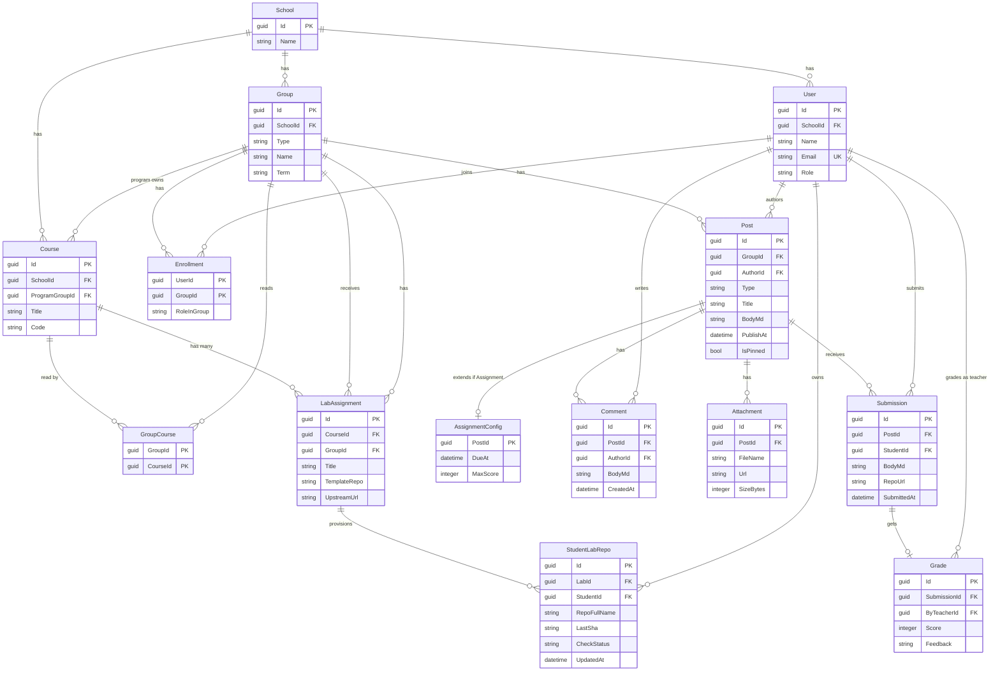

# Learnpoint-klon – ER-diagram (SQLite MVP)

```mermaid
erDiagram
    School ||--o{ User : "has"
    School ||--o{ Course : "has"
    School ||--o{ Group : "has"
    Group ||--o{ Course : "program owns"
    Course ||--o{ GroupCourse : "read by"
    Group ||--o{ GroupCourse : "reads"
    Course ||--o{ LabAssignment : "has many"
    Group ||--o{ LabAssignment : "receives"
    Group ||--o{ Enrollment : "has"
    User ||--o{ Enrollment : "joins"
    Group ||--o{ Post : "has"
    User ||--o{ Post : "authors"
    Post ||--o| AssignmentConfig : "extends if Assignment"
    Post ||--o{ Comment : "has"
    User ||--o{ Comment : "writes"
    Post ||--o{ Attachment : "has"
    Post ||--o{ Submission : "receives"
    User ||--o{ Submission : "submits"
    Submission ||--o| Grade : "gets"
    User ||--o{ Grade : "grades as teacher"
    Group ||--o{ LabAssignment : "has"
    LabAssignment ||--o{ StudentLabRepo : "provisions"
    User ||--o{ StudentLabRepo : "owns"

    School {
        guid Id PK
        string Name
    }
    User {
        guid Id PK
        guid SchoolId FK
        string Name
        string Email UK
        string Role
    }
    Course {
        guid Id PK
        guid SchoolId FK
        guid ProgramGroupId FK
        string Title
        string Code
    }
    Group {
        guid Id PK
        guid SchoolId FK
        string Type
        string Name
        string Term
    }
    GroupCourse {
        guid GroupId PK
        guid CourseId PK
    }
    Enrollment {
        guid UserId PK
        guid GroupId PK
        string RoleInGroup
    }
    Post {
        guid Id PK
        guid GroupId FK
        guid AuthorId FK
        string Type
        string Title
        string BodyMd
        datetime PublishAt
        bool IsPinned
    }
    AssignmentConfig {
        guid PostId PK
        datetime DueAt
        integer MaxScore
    }
    Comment {
        guid Id PK
        guid PostId FK
        guid AuthorId FK
        string BodyMd
        datetime CreatedAt
    }
    Attachment {
        guid Id PK
        guid PostId FK
        string FileName
        string Url
        integer SizeBytes
    }
    Submission {
        guid Id PK
        guid PostId FK
        guid StudentId FK
        string BodyMd
        string RepoUrl
        datetime SubmittedAt
    }
    Grade {
        guid Id PK
        guid SubmissionId FK
        guid ByTeacherId FK
        integer Score
        string Feedback
    }
    LabAssignment {
        guid Id PK
        guid CourseId FK
        guid GroupId FK
        string Title
        string TemplateRepo
        string UpstreamUrl
    }
    StudentLabRepo {
        guid Id PK
        guid LabId FK
        guid StudentId FK
        string RepoFullName
        string LastSha
        string CheckStatus
        datetime UpdatedAt
    }
```
